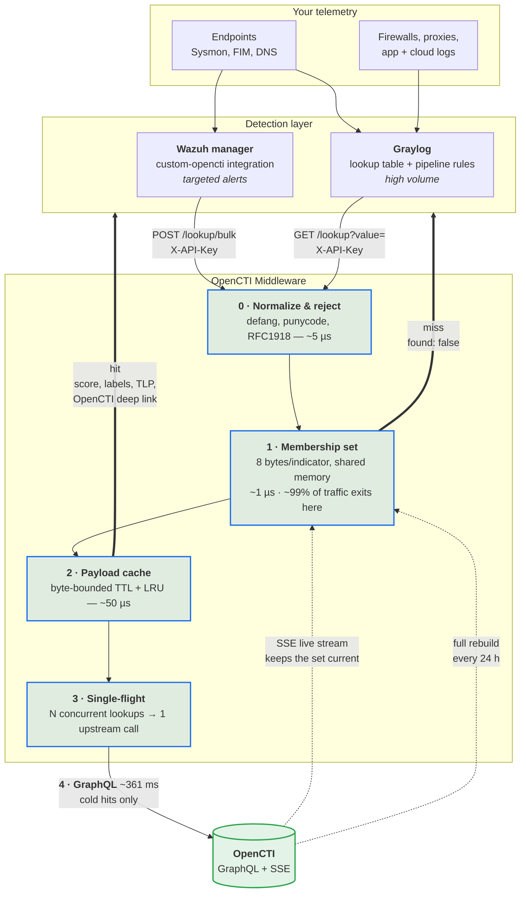

# OpenCTI Middleware

**Turn your OpenCTI instance into a threat-intel lookup service your SIEM can
call on every single log line.**

It answers one question, fast:

> Does this IP, domain, URL, or file hash have a live Indicator in OpenCTI?

Point Graylog or Wazuh at it and every matching event gets enriched with the
indicator's score, labels, TLP marking, validity window, and a deep link back
into OpenCTI — without hammering your OpenCTI instance.

### 📺 Video walkthrough

**[Watch the tutorial and walkthrough → https://youtu.be/UAaEjZnOeaU](https://youtu.be/UAaEjZnOeaU)**

A full tour: what it does, how to deploy it, and how to wire it into Graylog
and Wazuh.

> 🛠️ **Want it deployed and tuned for you?**
> SOCFortress offers [professional services](https://www.socfortress.co/solutions/professional-services)
> — deployment, integration with your existing Graylog/Wazuh stack, threat-intel
> pipeline design, and ongoing support.

---

## Contents

- [Why you'd want this](#why-youd-want-this)
- [How it fits together](#how-it-fits-together)
- [Quick start](#quick-start) — up and running in about five minutes
- [Connect your SIEM](#connect-your-siem) — Graylog or Wazuh
- [What comes back](#what-comes-back)
- [Configuration](#configuration)
- [Operating it](#operating-it)
- [Troubleshooting](#troubleshooting)
- [How it works](#how-it-works) — the design, and the measurements behind it
- [Development](#development)
- [Professional services](#professional-services)

**Docs:** [Architecture deep dive](docs/architecture.md) ·
[Graylog setup](docs/graylog-setup.md) ·
[Pipeline rules](docs/pipeline-rules.md) ·
[Wazuh integration](docs/wazuh.md)

---

## Why you'd want this

Calling OpenCTI's GraphQL API directly from a log pipeline does not work at
volume. A single query takes ~360 ms, and **around 99% of your log stream is
indicators OpenCTI has never heard of** — so you'd spend nearly all of that
time proving negatives.

This service puts a tiny in-memory structure in front of OpenCTI that can
answer "no" in about a microsecond:

|  | Miss (~99% of traffic) | Hit, warm | Hit, cold | OpenCTI down |
|---|---|---|---|---|
| Calling OpenCTI directly | 330 ms | 50 µs | 361 ms | everything reads as a miss |
| Mirroring all of OpenCTI locally | 10 µs | 10 µs | 10 µs | fine until the corpus outgrows RAM |
| **This middleware** | **~1 µs** | 50 µs | 361 ms once | **misses still perfect, hits still alert** |

That last column matters: if OpenCTI goes down, this keeps answering
correctly. It just can't add the enrichment detail.

**In short:**

- 🚀 **Fast enough for a full log stream** — misses never touch the network
- 🧠 **Small** — 10 million indicators fit in 80 MB, and that memory is shared
  across workers, not duplicated
- 🔄 **Always current** — an SSE live stream from OpenCTI applies new intel as
  it lands, with a periodic full rebuild as a backstop
- 🛟 **Degrades gracefully** — never returns a 5xx to your pipeline, never
  turns a hit into a miss
- 🔌 **Two ways in** — Graylog lookup tables for breadth, a Wazuh integration
  for targeted enrichment. Run both.

---

## How it fits together



**Reading it:** a log event reaches Wazuh or Graylog, which extracts an
indicator and asks this service about it. Almost every answer comes back from
tier 1 without a network call. The rare hit falls through to OpenCTI once, is
cached, and comes back enriched. Meanwhile OpenCTI pushes changes into the
membership set over SSE, so the set never goes stale between rebuilds.

---

## Quick start

**Prerequisites:** Docker, a reachable OpenCTI instance, and an OpenCTI API
token.

### 1. Get the code and generate a key

```bash
git clone https://github.com/socfortress/OPENCTI-MIDDLEWARE
cd OPENCTI-MIDDLEWARE
cp .env.example .env
python scripts/gen_token.py     # prints a token — paste it into API_KEY
```

### 2. Fill in three values in `.env`

```bash
API_KEY=<the token you just generated>
OPENCTI_URL=https://opencti.example.com
OPENCTI_TOKEN=<your OpenCTI API token>
```

Everything else has a working default. The service refuses to start on a bad
config and tells you every problem in one message.

### 3. Start it

```bash
docker compose up -d
```

No build step — Compose pulls a prebuilt multi-arch image
(`linux/amd64` + `linux/arm64`) from GitHub Container Registry:

```
ghcr.io/socfortress/opencti-middleware:latest        # tracks main
ghcr.io/socfortress/opencti-middleware:1.2.3         # release tags
ghcr.io/socfortress/opencti-middleware:sha-<commit>
```

> **Production tip:** pin a version or a digest. `:latest` moves.
> To build from source instead, comment out `image:` in `compose.yaml` and
> uncomment `build: .`.

### 4. Wait for it to be ready

On first boot the service downloads your indicator corpus from OpenCTI. That
takes a few seconds on a small instance and a few minutes on a large one.
`/readyz` stays `false` until it finishes, so orchestrators won't route traffic
early.

```bash
curl -s localhost:8000/readyz | jq
```

### 5. Try a lookup

```bash
# Something benign — expect a miss
curl -s 'localhost:8000/lookup?value=8.8.8.8' -H "X-API-Key: $API_KEY"
{"found":"false"}

# Something in your corpus — expect a hit
curl -s 'localhost:8000/lookup?value=212.193.31.122' -H "X-API-Key: $API_KEY"
```

```json
{
  "found": "true",
  "value": "212.193.31.122",
  "type": "IPv4-Addr",
  "match_type": "exact",
  "score": "20",
  "confidence": "100",
  "expired": "true",
  "labels": "aisuru,iot botnet,ddos attacks",
  "marking": "TLP:CLEAR",
  "created_by": "AlienVault",
  "opencti_url": "https://opencti.example.com/dashboard/observations/indicators/da45…"
}
```

### 6. Check your whole setup at once

```bash
curl -s localhost:8000/config/validate -H "X-API-Key: $API_KEY" | jq
```

This live-tests OpenCTI connectivity, checks your API key strength, and prints
the resolved memory budget and backend state. Run it first whenever something
looks wrong.

---

## Connect your SIEM

Both paths can run at the same time, and often should — Graylog for breadth,
Wazuh for alerts you want enriched inside Wazuh's own correlation.

| Path | Best for | Guide |
|---|---|---|
| **Graylog lookup tables** | High-volume streams — every network connection, every DNS query | **[docs/graylog-setup.md](docs/graylog-setup.md)** |
| **Wazuh integration** | Targeted enrichment — FIM hashes, specific rule groups, higher-severity alerts | **[docs/wazuh.md](docs/wazuh.md)** |

Ready-made Graylog pipeline rules for Linux and Windows/Sysmon shapes live in
**[docs/pipeline-rules.md](docs/pipeline-rules.md)**.

### Graylog in three pieces

<details>
<summary><b>Data adapter, cache, and lookup table — click to expand</b></summary>

**1 · Data adapter** (System → Lookup Tables → Data Adapters → Create, type
**HTTP JSONPath**):

| Setting | Value |
|---|---|
| Lookup URL | `http://opencti-lookup:8000/lookup?value=${key}` |
| Single value JSONPath | `$.found` |
| Multi value JSONPath | `$` |
| HTTP headers | `X-API-Key: <your API_KEY>` |

> ⚠️ **Exactly one query parameter.** Graylog URL-encodes the whole substituted
> key, so a second parameter arrives glued onto the value as
> `%26customer_code%3D…`. Tenant tags travel as an `X-Customer-Code` header
> instead, and come back echoed in the response.

**2 · Cache** — don't skip this. Type **Guava Cache**, max size `20000`,
expire after write `60 seconds`. It sits in front of the service, costs
nothing, and means a large share of lookups never leave Graylog at all.

**3 · Lookup table** — bind the adapter and cache, and name it
`opencti_indicators`. That name is what the pipeline rules reference. Leave
**Default single value** and **Default multi value** empty.

**Then write two rules.** Stage 1 enriches, stage 2 decides:

```java
// Stage 1 — enrich. set_fields() takes the whole map, so adding a response
// field later never means editing this rule.
rule "OpenCTI :: enrich destination_ip"
when
    has_field("destination_ip")
then
    let ioc = lookup("opencti_indicators", to_string($message.destination_ip));
    set_fields(fields: ioc, prefix: "threat_intel_");
end
```

```java
// Stage 2 — decide. Non-expired hits alert; expired hits stay as context.
rule "OpenCTI :: flag live indicator"
when
    to_string($message.threat_intel_found)   == "true" &&
    to_string($message.threat_intel_expired) == "false"
then
    set_field("alert", true);
    set_field("alert_source", "OpenCTI");
    set_field("alert_severity", to_string($message.threat_intel_score));
end
```

</details>

### Wazuh in two steps

<details>
<summary><b>Install the integration and add the config block — click to expand</b></summary>

```bash
sudo ./wazuh/install.sh              # or: sudo ./wazuh/install.sh /custom/path
```

Then add to `<ossec_config>` in `ossec.conf` and restart the manager:

```xml
<integration>
  <name>custom-opencti</name>
  <hook_url>http://opencti-middleware:8000</hook_url>
  <api_key>YOUR_MIDDLEWARE_API_KEY</api_key>
  <alert_format>json</alert_format>
  <group>sysmon_event3,sysmon_event1,sysmon_event_22,syscheck</group>
</integration>
```

The install script also ships rules `100910`–`100915`, which turn matches into
Wazuh alerts graded by score, labels, and whether the indicator is expired.

> ⚠️ **Scope the `<integration>` filter tightly.** Wazuh spawns a **new process
> per matching alert** — measured at ~73 ms each, of which ~44 ms is Python
> interpreter startup, so roughly **14 alerts/sec per analysisd thread**. That
> ceiling is the process spawn, not the lookup, and none of this service's
> speed is reachable through it. A bare `<level>3</level>` on a busy manager
> will saturate it. Send bulk traffic through Graylog instead.

</details>

---

## What comes back

Responses are **flat, all strings, no nulls, no arrays, no nesting** — Graylog
pipeline rules mishandle all four, so the serializer enforces it rather than
relying on convention. Absent fields are omitted rather than set to null.

| Field | Example | Notes |
|---|---|---|
| `found` | `true` / `false` | Always present |
| `value` | `1.2.3.4` | The normalized form |
| `type` | `IPv4-Addr` | STIX observable type |
| `score` | `75` | Indicator score, not observable score |
| `confidence` | `90` | |
| `expired` | `true` / `false` | `valid_until` has passed |
| `labels` | `c2,apt29` | Comma-joined, deduped, max 24 |
| `marking` | `TLP:AMBER` | |
| `created_by` | `AlienVault` | |
| `opencti_url` | `https://…/indicators/<id>` | Deep link for the analyst |
| `match_type` | `exact` / `hostname` | `hostname` means a URL matched on its host only |
| `degraded` | `true` | Only when OpenCTI was unreachable |

Full field reference: **[docs/graylog-setup.md](docs/graylog-setup.md#field-reference)**.

**Three response rules worth knowing:**

- A **hit** is `{"found": "true", …}`
- A **miss** is `{"found": "false"}` at **HTTP 200**, never 404 — Graylog's
  HTTPJSONPath adapter treats non-2xx as an adapter error, and misses are the
  common case
- **OpenCTI unreachable** is `{"found": "false", "degraded": "true"}`, still 200

---

## Configuration

Everything is set through `.env`. See **[`.env.example`](.env.example)** for
the full annotated list.

**Required:** `API_KEY`, `OPENCTI_URL`, `OPENCTI_TOKEN`.

A few settings are worth understanding before you tune anything:

| Setting | Default | What to know |
|---|---|---|
| `WORKERS` | `4` | Start at `min(cpu_count, 4)`. The familiar `cpu*2+1` formula is for *synchronous* workers and is wrong here — more workers means more fragmented payload caches and a lower hit rate. |
| `HIT_POLICY` | `expiry_aware` | Whether expired intel still counts as a hit. See [Hit semantics](#hit-semantics). |
| `MEMBERSHIP_SOURCE` | `observables` | `observables` reads values directly at ~4,500/sec; `indicators` walks the indicator→observable relationship at ~210/sec for exactness. The fast path's false positives self-correct, so switch only if observables greatly outnumber indicators — the ratio is logged at startup and warned on above 3:1. |
| `MIRROR_MAX_MEMORY_MB` | `auto` | Autodetection reads the **cgroup** limit before host RAM. Under Docker those differ, and only the cgroup number avoids the OOM killer. The resolved budget is logged loudly at startup. |
| `DOMAIN_MATCH_TYPES` | `Domain-Name,Hostname` | Both, because OpenCTI stores domains under both types. Dropping `Hostname` silently loses ~26% of a real domain corpus. |
| `STREAM_ENABLED` | `true` | The SSE live stream. Turn it off and the membership set becomes a boot-time snapshot that drifts. |

---

## Operating it

| Endpoint | Method | Purpose | Auth |
|---|---|---|---|
| `/lookup?value=` | GET | The one Graylog calls | API key |
| `/lookup/bulk` | POST | Batch, up to 500 values; for backfills, testing, and the Wazuh integration | API key |
| `/healthz` | GET | Liveness. Deliberately never touches OpenCTI | none |
| `/readyz` | GET | Config valid, backend loaded, breaker closed | none |
| `/metrics` | GET | Prometheus | none |
| `/config/validate` | GET | Deployment aid; live-tests OpenCTI | API key |

**Watch these three** in Prometheus or in `/readyz`:

- `stream_connected` — the SSE stream is alive. If it drops, the membership
  set stops receiving new intel.
- `stream_activity_lag_s` — seconds since *any* stream activity, heartbeats
  included. Past `STREAM_STALE_AFTER_S` (default 120s) the service stops
  trusting its own set and defers to live queries.
- `cache_hit_ratio` — if this is low, your `WORKERS` count may be fragmenting
  the payload cache.

---

## Troubleshooting

| Symptom | Likely cause |
|---|---|
| `/readyz` stays false | Bootstrap is still running — normal on a large corpus. Check the logs for `membership.load_failed`. |
| Everything returns `found: false` | Check `/config/validate`. Usually a bad `OPENCTI_TOKEN` or an unreachable `OPENCTI_URL`. |
| Responses carry `degraded: "true"` | OpenCTI is unreachable or the circuit breaker is open. Misses are still correct; hits just aren't enriched. |
| Graylog adapter shows errors | Something is returning non-2xx. A miss should be a 200 — check the API key header. |
| Graylog lookups all miss, but `curl` works | The pipeline rule is concatenating something onto the key. Pass the indicator alone; put tenant tags in an HTTP header. |
| Wazuh integration silent | The `<integration>` filter matches no alerts, or file ownership is wrong — must be `root:wazuh`, mode `750`. Check `/var/ossec/logs/integrations.log`. |
| Container OOM-killed | `MIRROR_MAX_MEMORY_MB=auto` reads the cgroup limit; make sure `compose.yaml`'s memory limit is actually set. |

Per-integration troubleshooting tables: **[Graylog](docs/graylog-setup.md)** ·
**[Wazuh](docs/wazuh.md#troubleshooting)**.

---

## How it works

You don't need any of this to run the service — but it explains why the
defaults are what they are. The full write-up, with the measurements behind
every decision, is in **[docs/architecture.md](docs/architecture.md)**.

The short version:

| | |
|---|---|
| **[The split](docs/architecture.md#why-its-built-this-way)** | Two questions with wildly different costs — "is this in OpenCTI at all?" is 8 bytes per indicator; "what is its score and labels?" is ~250. Only the cheap one has to cover the whole corpus. 10M indicators fit in 80 MB. |
| **[Memory safety](docs/architecture.md#memory-safety)** | A miss allocates nothing — it never reaches a cache, so unbounded scanner traffic costs zero memory permanently. The payload cache is bounded by TTL, LRU size, *and* max entry bytes. |
| **[Cross-worker sharing](docs/architecture.md#cross-worker-sharing)** | Workers elect a builder with a file lock. One bootstrap, one shared-memory segment, N attaches — not N copies. Failover publishes a new generation that readers adopt without a restart. |
| **[Live stream](docs/architecture.md#live-stream)** | An SSE consumer applies OpenCTI changes as they land, at no extra GraphQL cost. Staleness is keyed on *activity* including heartbeats, so a quiet night never looks like an outage. |
| **[Reconcile](docs/architecture.md#reconcile)** | A full rebuild every 24 h catches drift the stream can't see. The old segment serves throughout; nothing swaps until the new one is complete. |
| **[Hit semantics](docs/architecture.md#hit-semantics)** | Why a hit needs a curated Indicator and not just an observable, what `HIT_POLICY` actually changes, and why file hashes and domains each need special handling. |
| **[Normalization](docs/architecture.md#normalization)** | Defanging, punycode, IP canonicalization and URL folding — all ahead of every cache, so `HXXP://Evil.COM/a/` and `http://evil.com/a` are one key and one query. |

---

## Development

```bash
python -m venv .venv && .venv/bin/pip install -e '.[dev]'
.venv/bin/pytest                    # unit + respx-mocked integration
.venv/bin/ruff check . && .venv/bin/mypy src
```

Some tests spawn real subprocesses to exercise the cross-worker lock election
and shared-segment lifetime; those cannot be faked in-process. One test is
skipped on macOS, where POSIX shared memory is not visible as files under
`/dev/shm` — CI runs on Linux and covers it.

### Building the image yourself

```bash
docker build -t opencti-middleware .
# or multi-arch, as CI does:
docker buildx build --platform linux/amd64,linux/arm64 -t opencti-middleware .
```

CI lints, tests, builds both architectures, pushes to GHCR with build
provenance and an SBOM, then smoke-tests the published image — booting it
without a reachable OpenCTI and asserting it enforces auth and fails open
rather than returning 5xx.

## Professional services

Built and maintained by **[SOCFortress](https://www.socfortress.co)**.

If you'd rather not run this yourself — or you want a threat-intel pipeline
designed around your stack instead of bolted onto it — we do that:

**[SOCFortress Professional Services →](https://www.socfortress.co/solutions/professional-services)**

- Deployment and tuning of this middleware against your OpenCTI instance
- Graylog and Wazuh integration, pipeline rules, and alert triage design
- Threat-intel sourcing, curation, and OpenCTI connector work
- Ongoing support and managed SOC services

Bug reports and pull requests are welcome here regardless.

## License

MIT
